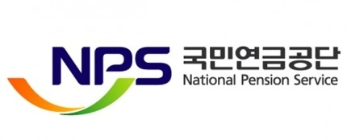

# 📊 NPS CEO News Monitor

> **국민연금공단(NPS) 이사장 언론 보도 실시간 모니터링 시스템**
>
> 본 프로젝트는 네이버 오픈 API와 GitHub Actions를 활용하여 김성주 이사장님 관련 신규 보도자료를 수집하고 텔레그램으로 전송합니다.

  

## ✨ 주요 기능

* **실시간 모니터링**: 약 15분 간격으로 네이버 뉴스를 자동 검색합니다.
* **정교한 키워드 필터링**: `"국민연금"`, `"김성주"` 조합을 통해 동명이인 오보도를 최소화합니다.
* **상세 정보 제공**: 기사 제목, 요약문, 발행 시간, 언론사 정보를 포함한 메시지를 전송합니다.

 

## 📱 알림 예시

> 📢 **NPS 새 기사 알림**
> 
> 📌 **제목**: 김성주 국민연금 이사장, 현장 소통 행보 강화  
> ⏰ **발표**: 2025-12-21 10:30  
> 🔗 **링크**: [기사 바로가기](https://news.naver.com...)

 

## 🚀 시작하기

* **텔레그램 채널 구독하기**: [NPS CEO News Monitor](https://t.me/nps_ceo_news_monitor) 링크를 클릭하고 **[시작]** 을 누르세요.

   

## ⚠️ 유의 사항

* 본 봇은 **국민연금공단 홍보실 내부 업무용**으로 제작되었습니다.
* 수집된 기사의 저작권은 각 언론사에 있으며, 본 시스템은 링크 공유 서비스만을 제공합니다.

 

## 🛠 기술 스택

* **Language**: Python 3.9+
* **Infrastructure**: GitHub Actions
* **API**: Naver Search API, Telegram Bot API
* **Database**: [기사 목록](https://github.com/roy8in/nps-news-monitor/blob/main/news_history.csv)
